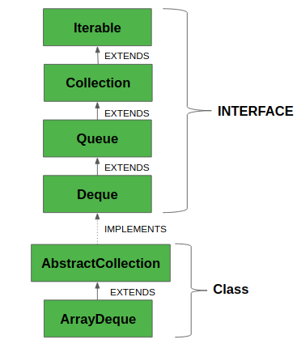
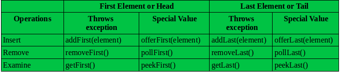

# Sliding Window Maximum

## Question
Given an array nums, there is a sliding window of size k which is moving from the very left of the array to the very right. You can only see the k numbers in the window. Each time the sliding window moves right by one position. Return the max sliding window.

Example:

Input: nums = [1,3,-1,-3,5,3,6,7], and k = 3
Output: [3,3,5,5,6,7] 
Explanation: 

Window position                Max
---------------               -----
[1  3  -1] -3  5  3  6  7       3
 1 [3  -1  -3] 5  3  6  7       3
 1  3 [-1  -3  5] 3  6  7       5
 1  3  -1 [-3  5  3] 6  7       5
 1  3  -1  -3 [5  3  6] 7       6
 1  3  -1  -3  5 [3  6  7]      7

 ## 最佳解法
 - 利用双向队列
  
## java 中的队列和双向队列

### Queue

- java 中的 Queue 是一个接口，继承自 Collection
- 该接口通常由 LinkedList, ArrayBlockingQueue and PriorityQueue 来实现，
  例如， `Queue<Integer> queue = new LinkedList<>();`

- 支持的方法

### Deque

- 双向队列，支持队首和队尾的插入和删除。既可以当栈，也可以当队列
- 通常的实现类，ArrayDeque 和 LinkedList 例如： 
  
  `Deque<Integer> q = new ArrayDeque<>();`
  
    `Deque<String> deque = new LinkedList<String>();`
- 支持的方法

- `ArrayDeque`  和 `LinkedList` 都实现了 Deque 接口，使用时选用：

    - ArrayDeque 内部是一个动态扩展的循环数组，效率高，应该被优先使用，但无法通过索引位置进行操作。
    - LinkedList 适用于经常需要在中间进行插入和删除，或者需要根据索引操作。

