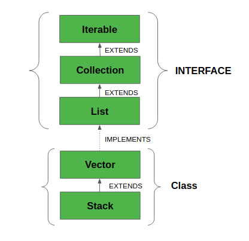

# 32. Longest Valid Parentheses

## Description

Given a string containing just the characters '(' and ')', find the length of the longest valid (well-formed) parentheses substring.

Example 1:

Input: "(()"
Output: 2
Explanation: The longest valid parentheses substring is "()"
Example 2:

Input: ")()())"
Output: 4
Explanation: The longest valid parentheses substring is "()()"

## java 中 Stack 使用

- Method

    - Object push(Object element) : Pushes an element on the top of the stack.
    - Object pop() : Removes and returns the top element of the stack. An ‘EmptyStackException’ exception is    thrown if we call pop() when the invoking stack is empty.
    - Object peek() : Returns the element on the top of the stack, but does not remove it.
    - boolean empty() : It returns true if nothing is on the top of the stack. Else, returns false.
    - int search(Object element) : It determines whether an object exists in the stack. If the element is       found, it returns the position of the element from the top of the stack. Else, it returns -1.

## 思路：

- 利用 '(' 和 ')' 的位置信息来求最大连续长度。
- 不需要在栈中保存 '(' 和 ')', 只需要保存位置信息